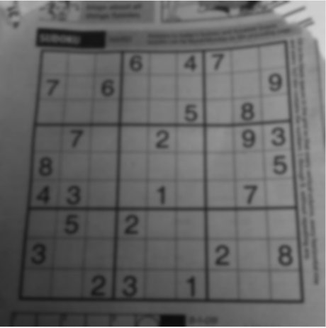
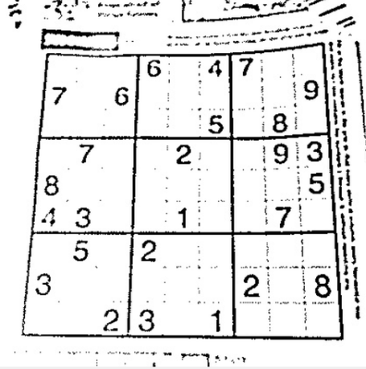
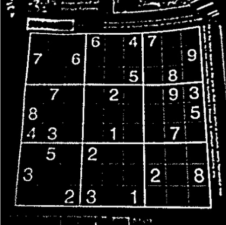
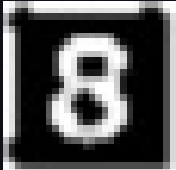

# Sudoku-Solver-using-KNN-and-Backtracking

This project is a **Visual Sudoku Solver** that can:
- Read a Sudoku puzzle **directly from an image**  
- Extract and recognize digits using **Computer Vision**  
- Classify digits using a **K-Nearest Neighbors (KNN)** model trained on MNIST  
- Solve the puzzle using **backtracking**  
- Show the solving process with a **clean GUI and animations**

A complete end-to-end project combining **Computer Vision**, **Machine Learning**, and **Algorithmic Problem Solving**.

---

##  Features

### 🔍 **1. Image-based Sudoku Digit Extraction**
- Detects Sudoku grid using contour detection  
- Warps perspective for perfect alignment  
- Splits into 9×9 cells  
- Performs cleanup (opening, thresholding, GaussianBlur)


### 🔢 **2. Digit Recognition (KNN Classifier)**
- Trained on the MNIST dataset  
- Preprocessing identical to training (threshold ➜ resize ➜ normalize ➜ flatten)  
- Additional validation:
  - Minimum pixel threshold  
  - Aspect ratio check  
  - Confidence threshold (if predict_proba available)

### 🧠 **3. Sudoku Solver Algorithm**
- Classic backtracking with safety checks  
- Cell-by-cell animation  
- Colored feedback:
  - Yellow → currently checking  
  - Green → number placed  
  - Red → backtracking step  

### 🖥️ **4. Tkinter GUI**
- Load Sudoku from image  
- Edit mode toggle  
- Clear board  
- Speed slider for animation  
- Highlighting of original vs solver-filled cells  

---

## 📂 Project Structure


```
Visual-Sudoku-Solver/
├── main.py                # GUI + CV + Solver
├── Knn_Train.py           # Train KNN on MNIST
├── knn_check.py           # Digit recognition test
├── KNN.sav                # Saved KNN model
├── debug_cells/           # Debug ROI images
├── sample_images/         # Pipeline images
└── README.md
```


---

---

# 🧠 Model Training (KNN)

The digit recognizer is a **K-Nearest Neighbors (KNN)** classifier trained on the MNIST dataset.

### 📌 Training Script (Knn_Train.py)

```python
from tensorflow.keras.datasets import mnist
from sklearn.neighbors import KNeighborsClassifier
import joblib

# Load MNIST
(x_train, y_train), (x_test, y_test) = mnist.load_data()

# Normalize + flatten
x_train = x_train.reshape(-1, 784) / 255.0
x_test = x_test.reshape(-1, 784) / 255.0

# Train KNN
knn = KNeighborsClassifier(n_neighbors=5)
knn.fit(x_train, y_train)

# Evaluate
print("Accuracy:", knn.score(x_test, y_test))

# Save model
joblib.dump(knn, "KNN.sav")
```

### ✅ Final Accuracy: **~97% on MNIST**

This model is lightweight, fast, and works well for clean digit crops.

---

# 🏞️ Image Processing Pipeline (Recommended Images)

Place the following images in your `sample_images/` folder for documentation:

| Step | Description | Filename |
|------|-------------|----------|
| 1 | Original Sudoku image | step1_original.jpg |
| 2 | Detected grid contour | step2_contour.jpg |
| 3 | Warped + thresholded grid | step3_warped.jpg |
| 4 | Extracted 9×9 cells | step4_cells.jpg |
| 5 | Raw digit ROI | step5_roi.jpg |
| 6 | Normalized 28×28 digit | step6_final28x28.jpg |

### 📌 Insert this block into your README after adding images:

```markdown
## 🔍 Image Processing Pipeline

<p align="center">
  
  
  
</p>

<p align="center">
  
  
  
</p>

```

---
